# Finite State Machine (FSM) & Computer Vision Automation

This module contains a set of robust automation agents designed to handle complex, non-linear workflows in mobile applications. Unlike simple "record-and-replay" scripts, these agents utilize **Finite State Machine (FSM)** architectures and **Computer Vision** to make dynamic decisions based on real-time screen states.

> **Status Note:** These tools (wb_bot_fsm and raid_bot_fsm) were developed for the mobile application *Destiny Child* (End of Service in late 2023). They are archived here to demonstrate **software architecture, algorithmic decision-making, and image processing** capabilities.

## Core Architecture

The agents operate on a closed-loop control system:
1.  **Observe:** Capture screen via ADB and analyze UI state using OpenCV (Template Matching + SSIM).
2.  **Decide:** Determine the current node in the State Machine (e.g., `IN_BATTLE`, `MENU`, `ERROR`).
3.  **Act:** Execute touch events or swipes via ADB Shell.
4.  **Recover:** Automatically detect anomalies (crashes, lags) and trigger self-healing routines.

```mermaid
stateDiagram-v2
    %% 定义样式
    classDef error fill:#f9f,stroke:#333,stroke-width:2px;
    classDef strategy fill:#e1f5fe,stroke:#01579b,stroke-width:2px,stroke-dasharray: 5 5;

    %% 初始状态
    [*] --> Emulator_Desktop : Start / Reset

    %% 主流程
    Emulator_Desktop --> Main_Menu : Launch App
    Main_Menu --> Activity_Selection : Enter Activity (WB/Raid/Map)
    
    %% 核心策略模块 (可替换部分)
    state "Abstract Activity Strategy Context" as Strategy_Context {
        direction LR
        [*] --> Analyzing_State
        Analyzing_State --> Executing_Action : Decision Made
        Executing_Action --> Result_Handling : Battle/Event Finish
        Result_Handling --> Analyzing_State : Next Loop
        
        note right of Analyzing_State
            <b>Polymorphic Logic:</b>
            1. Graph Scaning (Roguelike)
            2. Ticket Check (WB)
            3. OCR List Sort (Raid)
        end note
    }

    %% 连接主流程与策略模块
    Activity_Selection --> Strategy_Context : Initialize Strategy
    Strategy_Context --> Activity_Selection : Task Complete / Out of Tickets
    
    %% 异常处理流程 (全局)
    state UNKNOWN_STATE_ERROR ::: error
    
    Main_Menu --> UNKNOWN_STATE_ERROR : Timeout / Unrecognized
    Activity_Selection --> UNKNOWN_STATE_ERROR : Timeout / Unrecognized
    Strategy_Context --> UNKNOWN_STATE_ERROR : Logic Break / Crash

    %% 恢复机制
    UNKNOWN_STATE_ERROR --> Emulator_Desktop : Kill App & Restart (Self-Healing)

```

The diagram above illustrates the generalized control flow shared across all three automation agents. The system implements a **Hierarchical State Machine** design:
* **Outer Loop (Lifecycle Management):** Handles application launching, menu navigation, and the critical "Self-Healing" mechanism. If any state transitions to `UNKNOWN_STATE` (due to lags, crashes, or pop-ups), the agent automatically kills the app and returns to the `Emulator_Desktop` state to reset.
* **Inner Loop (Strategy Pattern):** The `Abstract Activity Strategy Context` represents the variable logic specific to each game mode. While the input (Screen State) and output (Action) interfaces are consistent, the internal decision-making algorithms vary:
* **Roguelike Agent:** Implements graph traversal to navigate map nodes.
* **WB Bot:** Uses a linear state loop for repetitive battle grinding.
* **Raid Bot:** Employs OCR-based list filtering to select optimal targets.

## Modules Overview

### 1. Roguelike Graph Traversal Agent
**File:** `fsm_controllers/clover_roguelike_agent.py`

An intelligent agent designed to navigate a procedurally generated dungeon map (Roguelike topology).
* **Challenge:** The map layout changes every run; nodes (Battles, Events, Shops) are randomized.
* **Solution:** Implemented a **Graph Traversal Algorithm** to scan the screen for valid next moves.
* **OCR Integration:** Uses **Baidu OCR API** to read event titles (text) and to select the optimal reward with a JSON strategy file (`event_opt.json`) .

### 2. High-Frequency FSM Controller (WB Bot)
**File:** `fsm_controllers/wb_bot_fsm.py`

A dedicated state machine for handling high-frequency, repetitive battle loops with strict timing constraints.
* **State Management:** Strictly defined states (`IN_WB_LIST`, `PREP_PAGE`, `IN_BATTLE`) prevent logic de-syncs.
* **Robustness:** Includes a "Watchdog" timer. If a battle takes too long (e.g. network disconnecting), it forces an app restarting and navigating back to the specific game mode automatically.

### 3. OCR Decision Bot (Raid Bot)
**File:** `fsm_controllers/raid_bot_fsm.py`

An advanced bot capable of sorting and filtering target instances based on numerical values.
* **Hybrid Recognition:** Combines visual icons (for navigation) with **OCR** (to read HP values and boss levels).
* **Logic:**
    * *Slayer Mode:* Navigates through nested menus to access high-difficulty instances.
    * *Smart Sorting:* Identifies bosses with specific HP thresholds to optimize resource usage.

## Key Technologies

### Advanced Image Verification
To solve the issue of "disabled" (grayed-out) buttons looking similar to "active" buttons, a two-pass verification system was implemented in `utils/img_utils.py`:
1.  **Pass 1 (Geometric):** Standard Template Matching (`cv2.matchTemplate`) finds the button location.
2.  **Pass 2 (Structural):** **Structural Similarity Index (SSIM)** checks the pixel intensity distribution to confirm if the button is active (color) or disabled (grayscale).

.png)

### Modular Design
* **`utils/ADBShell.py`**: A wrapper for Android Debug Bridge commands, handling connection pools and device selection.
* **`utils/baidu_ocr.py`**: Encapsulated API calls for cloud-based text recognition.