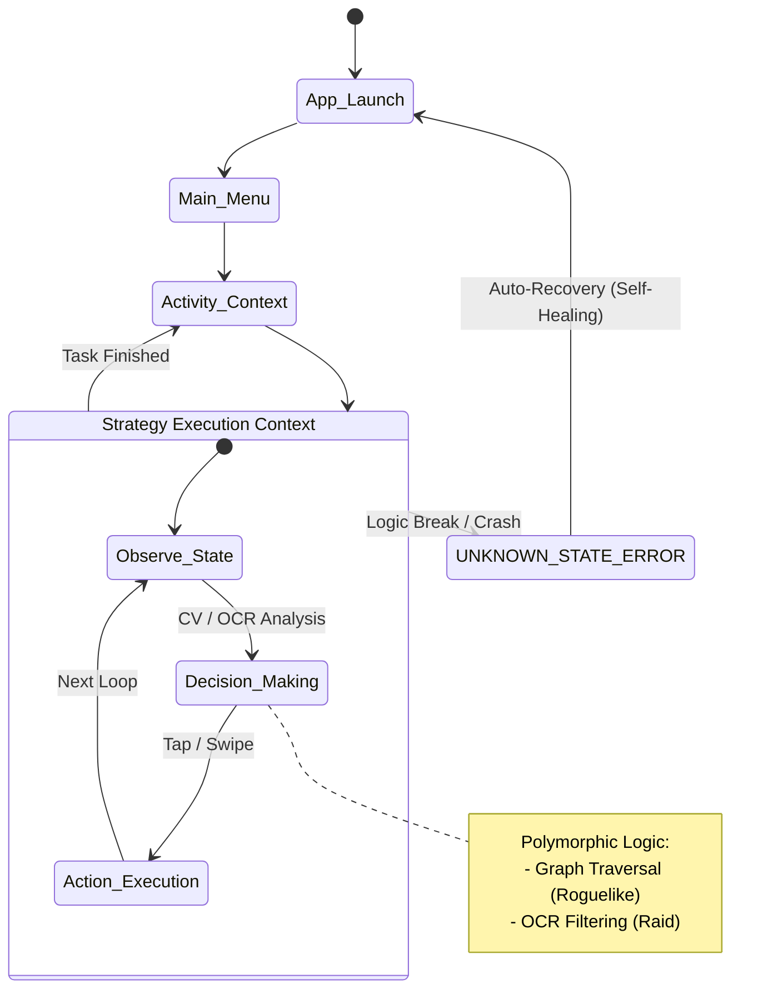

# Python Automation & Data Extraction Portfolio

  

## Overview

This repository is a comprehensive portfolio demonstrating **Data Engineering** and **Process Automation** capabilities using Python. It was to showcase practical skills relevant to **Data Services** and **Research Infrastructure**, including:

* **ETL Pipelines:** Extracting structured data from REST APIs and unstructured HTML.
* **DevOps Practices:** Service monitoring, configuration management (`yaml`), and automated alerting.
* **Complex Logic Design:** Implementing Finite State Machines (FSM) and Computer Vision for non-linear workflow automation.

## Project Structure

```text
.
├── 01_web_scraping/          # API Reverse Engineering & HTML Parsing
├── 02_service_monitoring/    # Persistent Monitoring Services (SMTP/Config)
├── 03_gui_automation_rpa/    # Advanced Visual Automation Agents (FSM/OCR)
├── config.yaml               # Configuration Template
├── requirements.txt          # Project Dependencies
└── README.md                 # Main Documentation

```

---

## Module 1: Web Data Extraction

**Directory:** [`01_web_scraping/`](01_web_scraper)

Scripts designed to harvest high-quality data from academic platforms, demonstrating distinct extraction strategies.

* **DAAD Program Scraper:**
* **Method:** **API Reverse Engineering**. Bypasses slow HTML parsing by interacting directly with the backend Solr API (`search.json`) to fetch clean JSON data.
* **Output:** Structured CSV dataset of International Master's Programmes.


* **TOEFL Content Spider:**
* **Method:** **DOM Parsing & Regex**. Uses `BeautifulSoup` to traverse nested HTML structures and regular expressions to sanitize text content from educational materials.


---

## Module 2: Service Monitoring System

**Directory:** [`02_service_monitoring/`](02_service_monitoring)

A persistent background service designed to track real-time availability of student housing.

* **Architecture:**
* **Config-Driven:** Uses `config.yaml` to manage target URLs, intervals, and credentials securely.
* **Alerting:** Integrated with **SMTP** to trigger instant email notifications upon detecting specific text changes (e.g., removal of "No rooms available" notice).
* **Robustness:** Implements random jitter and error recovery loops to maintain long-term stability.


---

## Module 3: FSM & Visual Automation (RPA)

**Directory:** [`03_gui_automation_rpa/`](03_gui_automation_rpa)

> **Deep Dive:** For detailed technical documentation, class diagrams, and algorithm explanations, please read the **[Module 3 README](03_gui_automation_rpa/android_fsm_controller/README.md)**.

An advanced automation framework originally developed for mobile application workflows (*Destiny Child*). It demonstrates the ability to handle complex, non-linear logic using **Computer Vision** and **Finite State Machines**.

### Core Architecture: Finite State Machine (FSM)

Instead of fragile linear scripts, this module implements a **Hierarchical State Machine**. The system continuously cycles through *Observation (CV)*, *Decision (Logic)*, and *Action (ADB)*, featuring a **Self-Healing** mechanism that recovers from crashes automatically.



### Key Highlights

1. **Hybrid Recognition:** Solves the "Grayed-out Button" problem using **Structural Similarity Index (SSIM)** verification alongside Template Matching.
2. **OCR Integration:** Integrates Cloud OCR APIs to parse dynamic text (e.g., event titles) for intelligent decision-making.
3. **Graph Traversal:** Implements a traversal algorithm to navigate procedurally generated maps (Roguelike Agent).

---

## Technical Stack

| Category | Libraries / Tools |
| --- | --- |
| **Data Extraction** | `requests`, `urllib`, `BeautifulSoup4`, `json`, `re` |
| **Automation & DevOps** | `smtplib`, `PyYAML`, `time`, `logging` |
| **Computer Vision** | `opencv-python`, `numpy`, `scikit-image`, `Pillow` |
| **Architecture** | Finite State Machine (FSM), Strategy Pattern |

## Quick Start

1. **Install Dependencies:**
```bash
pip install -r requirements.txt

```


2. **Configuration (for Module 2):**
Copy `config.yaml` and update it with your SMTP credentials (use App Passwords) and target URL.
3. **Run Examples:**
```bash
# Run the monitoring service
python 02_service_monitoring/dormitory_monitor.py

```